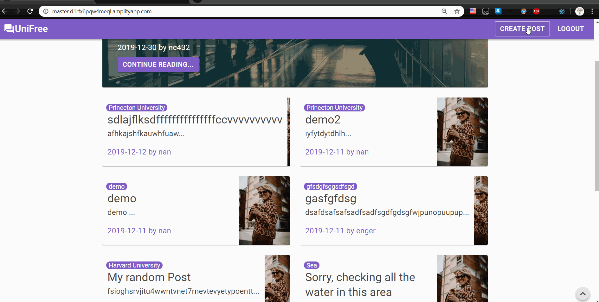

[](https://codeclimate.com/github/JiejayLan/unifreefrontend/maintainability) [](https://travis-ci.org/JiejayLan/unifreefrontend) [](https://coveralls.io/github/JiejayLan/unifreefrontend?branch=develop)

# UniFree
- This project is our class project for CSC59939, instructed by Nikolai Avteniev

# Demo



## UniFree Frontend 
[Production Site](https://master.d1rfx6pqw4meql.amplifyapp.com/)
[Develop Branch Site](https://develop.d2umjgzotd25pz.amplifyapp.com/)

## UniFree Backend
[Github Repo](https://github.com/songrenzhao/rdb-crud-microservice)

## Built With

+ [Create React App](https://github.com/facebook/create-react-app) - Create new React App with no build configuration
+ [React](https://reactjs.org/) - Building user interfaces
+ [Axios](https://github.com/axios/axios) - Promise based HTTP client
+ [Material-UI](https://material-ui.com/) - React UI framework
+ [Storybook.js](https://github.com/storybookjs/storybook) - React component documentation
+ [Jest](https://jestjs.io/) - JavaScript testing Framework
+ [React Testing Library](https://github.com/testing-library/react-testing-library) - React DOM testing utilities 

## Getting Started

1. Clone repo

2. Download [Node.js](https://nodejs.org/en/download/)

3. Install all npm packages

```
$ npm install
```

4. Setup .env file

- add .env file at root of project folder

5. Run command to start development server

```
$ npm run start
```
## Frontend Documentation
[Storybook.js](https://jiejaylan.github.io/unifreefrontend/docs)
<hr>

# Team Members
- Songren Zhao
- Yuting Yang
- Jin Chen
- Nan Chen
- Jie Lan
- Enger Then

